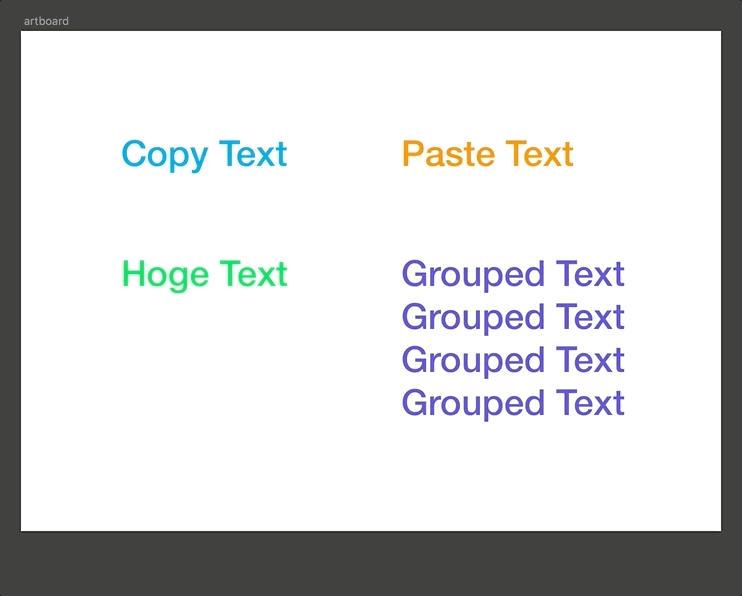
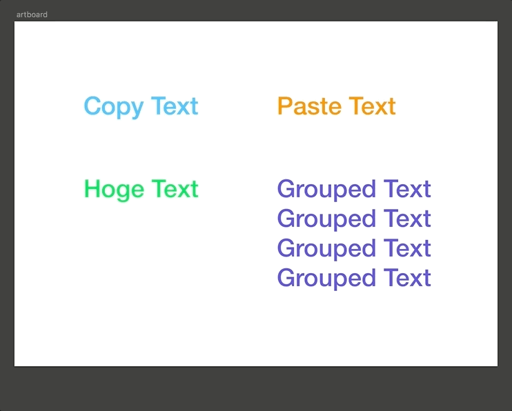

# Sketch Plugin - Copy and Paste Text(s)
Sketch plugin to copy &amp; paste only text from selected layers.

## Copy and Paste

## Copy multi selected texts and Paste

## Copy and Paste to group texts

Inspired: [sketch-copy-text-only](https://github.com/explorador/sketch-copy-text-only)
